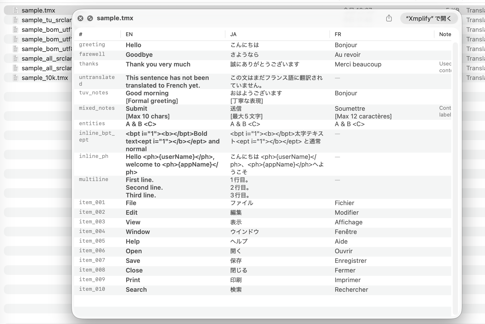

# TMXQL — TMX QuickLook Preview Extension

A macOS QuickLook extension that previews TMX 1.4b files (`.tmx`) directly in Finder by pressing the space bar.

Displays translation units in a grid format with one column per language. The source language column is placed first.



## Features

- Grid preview of TMX 1.4b files
- Dynamic columns based on languages found in the file
- Source language (`srclang`) column placed first
- Per-TU `srclang` override support (bold highlight shifts per row)
- Inline tag rendering (`<bpt>`, `<ept>`, `<ph>`, `<it>`, `<hi>`, etc.)
- Text wrapping with dynamic row heights

## Installation

1. Download `TMXQLApp.app` from [Releases](../../releases)
2. Copy `TMXQLApp.app` to `/Applications`
3. Remove the quarantine attribute (required because the app is unsigned):
   ```bash
   xattr -cr /Applications/TMXQLApp.app
   ```
4. Launch `TMXQLApp.app` once (this registers the extension with macOS)
5. Select a `.tmx` file in Finder and press Space to preview

## Uninstallation

1. Move `/Applications/TMXQLApp.app` to Trash
2. Run `qlmanage -r` in Terminal to reset the QuickLook cache

## Building from Source

### Run

1. Open `TMXQLApp.xcodeproj` in Xcode
2. Select the `TMXQLApp` scheme
3. Product → Run (⌘R)

### Export for Distribution

1. Product → Archive
2. Distribute App → Custom → Copy App
3. Distribute the exported `TMXQLApp.app`
